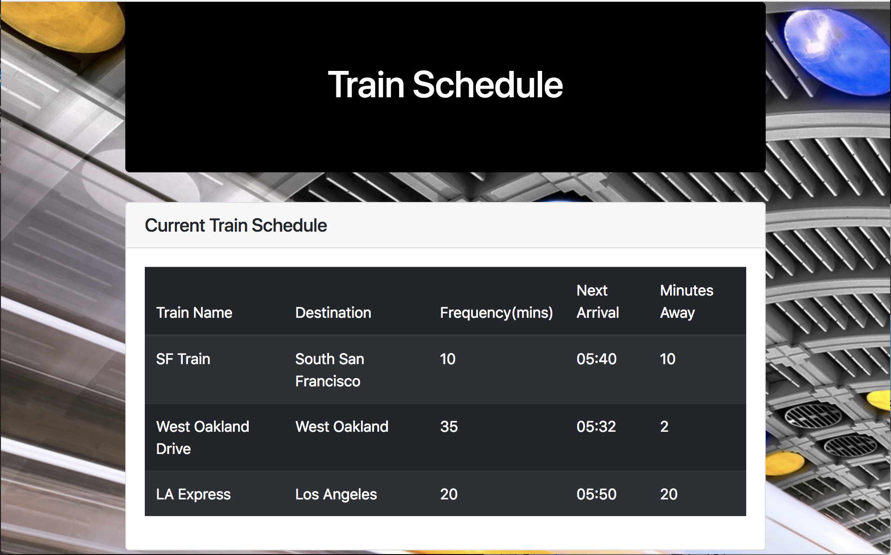
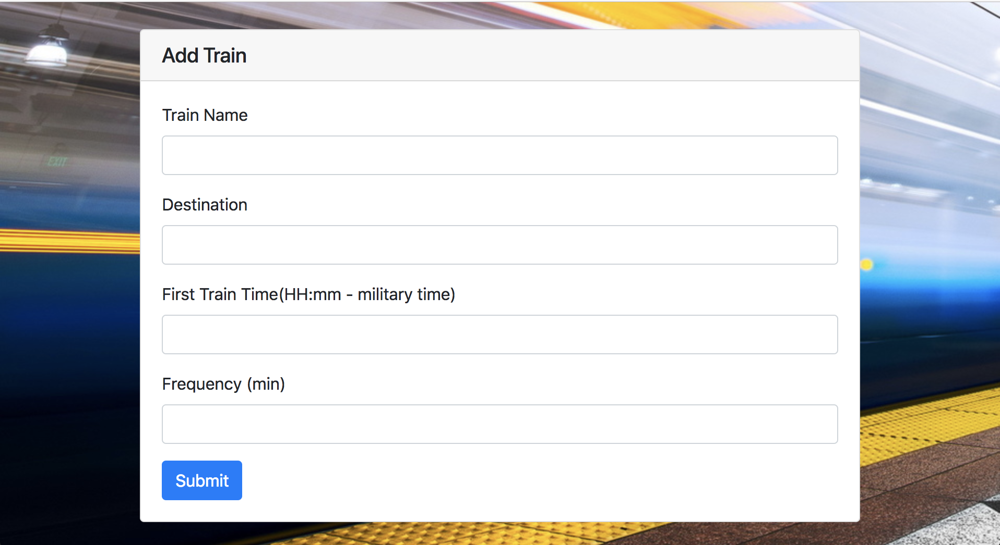

# Train-Schedule

Train Schedule program created with Firebase to store and display time that trains will come to the station. 

[Train Schedule](https://mawais54013.github.io/Train-Scheduler/)

[Portfolio](https://mawais54013.github.io/New-Portfolio/)

# Images


Display schedule of trains with the times they will be coming.



Add a train here and it will be shown above and every time the page is refreshed because it is in the database.


# Technology Used
- HTML
- CSS
- JavaScript
- Jquery
- Boostrap
- Firebase(database)

# Code Snippets
1) This code snippet shows firebase is used to store the information from userInput. Var database is configured with the firebase and everything is pushed to it. 
```
firebase.initializeApp(config);

  var database = firebase.database();

  $("#add-train-btn").on("click", function(event){

    event.preventDefault();

    var trainName = $("#inputName").val().trim();
    var trainDest = $("#inputPlace").val().trim();
    var trainTime = $("#inputTime").val().trim();
    var trainFreq = $("#inputFreq").val().trim();

    var newTrain = 
    {
        name: trainName,
        dest: trainDest,
        time: trainTime,
        freq: trainFreq
    };

    database.ref().push(newTrain);
```
2) This code snippet takes the time the first train will arrive and chnages it to match present time. The we take the current time and find the difference between that present time and the next rain arrival. Whatever remains is are the minutes til the next rain. 
```
    var Frequency = trainFreq;
    var firstTime = trainTime;

    var timeConverted = moment(firstTime, "HH:mm").subtract(1,"years");
    console.log(timeConverted);

    var currentTime = moment();
    console.log("CURRENT TIME: " + moment(currentTime).format("hh:mm"));

    var differTime = moment().diff(moment(timeConverted), "minutes");
    console.log("DIFFERENCE IN TIME: " +differTime);

    var remainder = differTime % Frequency;

    var minutesTill = Frequency - remainder;

    var nextTrain = moment().add(minutesTill, "minutes");

    var nTrain = moment(nextTrain).format("hh:mm");
```

# Author 
[Muhammad Awais](https://github.com/mawais54013/Bootstrap-Portfolio)
